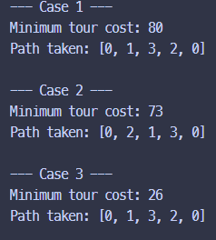

# Travelling Salesman Problem Solver in Rust

This project solves the **Travelling Salesman Problem (TSP)** using **Dynamic Programming** with bitmasking.

## Features

- Solves multiple TSP test cases.
- Shows minimum tour cost and the full path taken.

## Getting Started

### Prerequisites

- [Rust](https://www.rust-lang.org/tools/install) installed (use `rustup`)

### Running the Program

```bash
cargo run
```

## Test Case
<p align="center">
  
  
</p>
